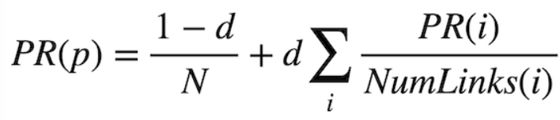
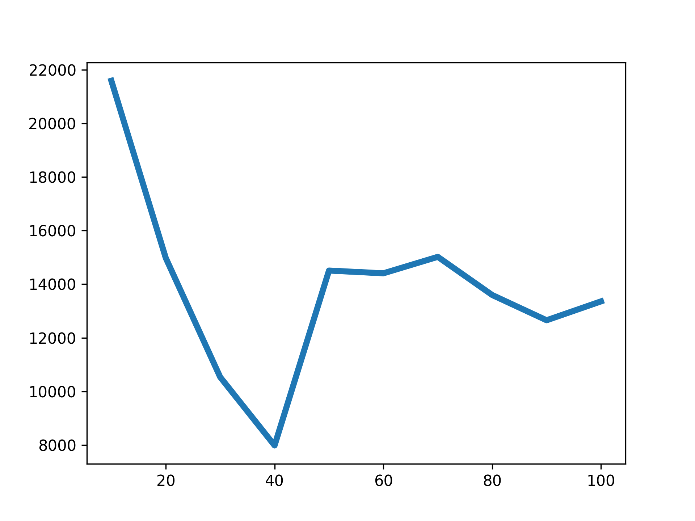
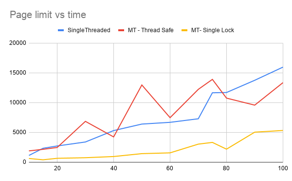

# Multi Threaded Web-Crawler

## Description
The goal of this project is to create a multi-threaded web crawler. A Web crawler is an Internet bot that systematically browses the World Wide Web, typically for the purpose of Web indexing. Any search engine uses these indexes, web graphs, and an appropriate algorithm ( such as PageRank ) to rank the pages. The main focus of the project would be to implement a multi-threaded downloader that can download multi websites at the same time. The plan is to implement this in C or C++.

## Features/Deliverables
 - Part 1: Multi-threaded web-crawler
 - Part 2: (Extended scope) Web Ranking
 
## Simple Crawler Flowchart

<!--ts-->
## [Table of contents](#table-of-contents)
- [Single Threaded Web Crawler](#single-threaded-web-crawler)
    - [Single Threaded Components](#single-threaded-components)
    - [Single Threaded Psuedocode](#single-threaded-psuedocode)
    - [How to run single threaded web crawler](#how-to-run-single-threaded-web-crawler)
- [MULTITHREADED Web Crawler](#multithreaded-web-crawler)
    - [Multithreaded Components](#multithreaded-components)
    - [Multithreaded Psuedocode](#multithreaded-psuedocode)
    - [Different locking techniques](#different-locking-techniques)
        - [Using SINGLE LOCK technique](#using-single-lock-technique)
        - [Using THREAD SAFE DATA STRUCTURE technique](#using-thread-safe-data-structure-technique)
    - [How to run multi threaded web crawler](#how-to-run-multi-threaded-web-crawler)
- [Website domain ranking algorithms](#website-domain-ranking-algorithms)
    - [Simple counter based](#simple-counter-based)
    - [Sampling based PageRank algorithm](#sampling-based-pagerank-algorithm)
    - [Iterative based PageRank algorithm](#iterative-based-pagerank-algorithm)
- [Graphs](#graphs)
- [Libraries used](#libraries-used)
- [Future extension of project](#future-extension-of-project)
- [Repo structure](#repo-structure)
- [How to reuse this repo](#how-to-reuse-this-repo)
- [Credits](#credits)
- [Contributors](#contributors)
<!--te-->

## [Single Threaded Web Crawler](#single-threaded-web-crawler)

### [Single Threaded Components](#single-threaded-components)
- HTTP website downloader
    - using socket library
- HTTPs websites downloader
    - using openssl library
- HTML file parser
    - using regex
- Domain extractor
    - using regex
- Crawler loop
- Website ranker
    - using a simple counter
    
### [Single Threaded Psuedocode](#single-threaded-psuedocode)
<pre><code>    ...
    while(!mainQueue.empty() && totalVisitedPages < pagesLimit)
    {
        currWebsite = mainQueue.pop()
        html = websiteDownloader(currWebsite)
        linkWebsite = htmlParser(html)
        update(discoveredWebsites, mainQueue, totalVisitedPages)
    }
    ...</code></pre>
    
### [How to run single threaded web crawler](#how-to-run-single-threaded-web-crawler)
- use `make` to compile the program
- `maxlinks`, `pagelimit` can be given as argument in with `make` command.
    - For e.g. `make maxlinks=100 pagelimit=100`
    - Here the arguments are:
        - `maxlinks`: Maximum number of links to be extracted from a website
        - `pagelimit`: Maximum number of websites to be downloaded while crawling

_[Back to Table of Contents](#table-of-contents)_

## [MULTITHREADED Web Crawler](#multithreaded-web-crawler)

### [Multithreaded Components](#multithreaded-components)
 - **Crawler** as a thread controller
 - **Child thread**
    - HTML downloader
    - Link extractor
    - Domain extractor
    - Ranking using different algorithms

### [Multithreaded Psuedocode](#multithreaded-psuedocode)
### Crawler loop code
<pre><code>...
while(1){
    if(pagesLimitReached || visitedpages>=pagesLimit){
        pagesLimitReached = true;
        if(w_threads){
            <b>gotosleep()</b>;
        }
        else {
            break;
        }
    }
    else{
        if (w_threads < maxThreads && queue_size>0){
            createThread();
        }
        else if(w_threads == 0){
            break;
        }
        else{
            <b>gotosleep()</b>;
        }
    }
}
...</pre></code>

### Child Thread code
<pre>
<code>
...
download(url);
parse(url);
update(queue, visitedLinks, ranking);
if(pagesLimitReached){
    if(workingThreads == 0){
        <b>wake_parent()</b>;
    }
}
else{
    <b>wake_parent()</b>;
}
...
</pre></code>

### [Different locking techniques](#different-locking-techniques)
- [**Using SINGLE LOCK technique**](#using-single-lock-technique)
    - Having one lock for all of our shared variables
    - *Pros* Easy to implement
    - *Cons* Need to keep the lock acquired for more amount of time which may result in serial processing only
 
- [Using **THREAD SAFE DATA STRUCTURE** technique](#using-thread-safe-data-structure-technique)
    - For each of the data structure, having a single lock or RW lock if required
    - Waiting time distributed over different locks
    - Different thread safe data structures:
        - Thread safe integer
        - Thread safe queue
        - Thread safe map
    - *Pros* No need to keep the lock acquired for more amount of time. Hence concurrency can be efficiently achieved in multi processor CPUs
    - *Cons* Overhead due to multiple locks

### [How to run multi threaded web crawler](#how-to-run-multi-threaded-web-crawler)
- use `make` to compile the program
- `maxlinks`, `pagelimit`, `threads` can be given as argument in with `make` command.
    - For e.g. `make maxlinks=100 pagelimit=100 threads=20`
    - Here the arguments are:
        - `maxlinks`: Maximum number of links to be extracted from a website
        - `pagelimit`: Maximum number of websites to be downloaded while crawling
        - `threads`: Maximum number of threads to be created
        - `rankerFlag`: Flag to choose which ranking algorithm to be executed (`n` = simple counter based web ranker, `sp` = pagerank with sampling, `ip` = pagerank with iteration)

_[Back to Table of Contents](#table-of-contents)_

## [Website domain ranking algorithms](#website-domain-ranking-algorithms)
- [Simple counter based](#simple-counter-based)
    The intuition behind this approach of ranking is to increase the rank of a domain name whenever we visit it.
- [PageRank algorithm](https://cs50.harvard.edu/ai/2020/projects/2/pagerank/)
    The intuition behind our pagerank algorithm is as follows. Suppose there is a random surfer which randomly chooses a starting website. After that it chooses next website from all the linked website with current chosen website with probability of 0.85 or it chooses next website from all available websites with a probability of 0.15. 
    
    In this way, the importance of a website is measured by how repetitively a random surfer visits a website. Hence, a website is important if it is linked to more number of important websites.

    There are two ways to implement this algorithm
    - [Iterative based PageRank algorithm](#iterative-based-pagerank-algorithm)
    - [Sampling based PageRank algorithm](#sampling-based-pagerank-algorithm)

### [Simple counter based](#simple-counter-based)

<pre><code>
...
corpus = read(csv_file)
for website in corpus.keys():
    for x in corpus[website]:
        rank[website]+=1
...
</code></pre>

#### Demo run
<pre><code>------------------------------------------------
  Domain Name rankings using counter
------------------------------------------------

................................................
  Domain Name            Rank
................................................

1 .  mygov.in                                  43
2 .  main.ayush.gov.in                         36
3 .  tourism.gov.in                            24
4 .  digitalindia.gov.in                       19
5 .  asi.nic.in                                16
------------------------------------------------------------</pre></code>

_[Back to Table of Contents](#table-of-contents)_

### [Sampling based PageRank algorithm](#sampling-based-pagerank-algorithm)
In this approach, we have asked random surfer for certain number of sample times to choose a website from all websites which are weighted as per the pagerank algorithm intuition.

<pre><code>
...
DAMPING = 0.85
SAMPLES = 10000

corpus = read(csv_file)

for i in range(1,SAMPLES):
    for x in corpus.keys():
        if (x in corpus[page]):
            model[x] = ((DAMPING * (1/number_of_linked_websites)) + ((1-DAMPING)* (1/total_websites)))
        else:
            model[x] = ((1-DAMPING)* (1/total_websites))
    x = random.choices(websites, weights=model.values())[0]
    pagerrank[x] += (1/n)
return pagerrank
...
</code></pre>

#### Demo run
<pre><code>-------------------------------------------------------------
  Domain Name ranking using PageRank: Sampling (n = 10000)
-------------------------------------------------------------

................................................
  Domain Name            Rank
................................................

1 .  haryana.mygov.in                          0.1290000000000021
2 .  chhattisgarh.mygov.in                     0.11000000000000212
3 .  blog.mygov.in                             0.07730000000000119
4 .  mygov.in                                  0.07260000000000105
5 .  aatmanirbharbharat.mygov.in               0.04840000000000036
------------------------------------------------------------</pre></code>

_[Back to Table of Contents](#table-of-contents)_

### [Iterative based PageRank algorithm](#iterative-based-pagerank-algorithm)
The intuition behind ranking using iterative pagerank algorithm is as follows. We will intialize the probability of surfer visiting a given website to 1/total_websites. We will update the probability of every website according to below formula. 

We will stop iterating when the difference between old and updated probabilities is less than certain threashold.

<pre><code>
...
DAMPING = 0.85
THRESHOLD = 0.001
corpus = read(csv_file)

while(1):
    before = [pagerrank[v] for v in pagerrank.keys()]
    for x in corpus.keys():
        for v in linkedWebsites:
            pagerrank[x] += (DAMPING*(pagerank[v]/total_linkedWebsites))
        pagerank[x] += ((1-DAMPING)/number_of_websites)
        
    if (change(before, [pagerrank[v] for v in pagerrank.keys()]) <= THRESHOLD):
        break

return pagerrank
...
</code></pre>

#### Demo run
<pre><code>----------------------------------------------
  Domain Name ranking using PageRank: Iteration
----------------------------------------------

................................................
  Domain Name            Rank
................................................

1 .  india.gov.in                              0.01762736346840192
2 .  digitalindia-gov.zoom.us                  0.017587054793058533
3 .  tourism.gov.in                            0.016866581191734113
4 .  digitalindiaawards.gov.in                 0.014974653859083446
5 .  mygov.in                                  0.0122561916194452
------------------------------------------------------------</pre></code>

_[Back to Table of Contents](#table-of-contents)_

## [Graphs](#graphs)
- We have made a graph between number of threads vs time. According to this graph, we can infer as follows:
    - When number of threads are very low, time required for crawling is large
    - Time increases when number of threads becomes huge becuase of locking overhead
    - When we use optimal number of threads, concurrent crawling is useful.

** Above graph varies whenever your run the code. Above all inferences are made according to general trend in graph which is seen for most of times

- We have made a graph by varying one of our parameters pagelimit vs time. According to this graph, we can infer as follows:
    - As pagelimit increases, crawler time increases
    - Multithreaded with single locking works better than single threaded becuase of concurrency
    - Multithreaded with thread safe data structures works worst than other two appraoches because of locking overheads. Because in this approach, we have used individual locks for each data structures. And while crawling we needed to acquire and release locks back to back to update each data structure. This increases lot of overhead. As a result, time increases singnificantly in this approach

_[Back to Table of Contents](#table-of-contents)_

## [Libraries used](#libraries-used)
 - Sockets
 - OpenSSL
 - Pthread library
    - For concurrency and synchronization techniques
       - Locks
         - Single locks
         - Reader Writer locks
       - Condition Variables
 - Matplotlib
    - Plotting the graphs

## [Future extension of project](#future-extension-of-project)
- Efficient downloader to download all websites
- Efficient parser to parse large websites
- Creating a search engine by using web indexing and web scraping

## [Repo structure](#repo-structure)
- Three main branches:
    - `main`: contains the multithreaded using threadsafe data structure web crawler
    - `MT_singlelock`: contains the multithreaded using single lock web crawler
    - `single_threaded`: contains the single threaded web crawler
    
_[Back to Table of Contents](#table-of-contents)_

## [How to reuse this repo](#how-to-reuse-this-repo)
- `fork` the repo from top right corner of this page
- Run following in your terminal
<pre><code>
    $ git clone https://github.com/[USERNAME]/Web-Crawler
    $ cd Web-Crawler
    $ make
</pre></code>
- Pull requests are highly appreciated

- All the codes are well commented, in case of query feel free to contact
  - anupam.kumar@iitgn.ac.in
  - shruti.katpara@iitgn.ac.in
  - preeti.chiluveru@iitgn.ac.in
  - vivek.modi@iitgn.ac.in

## Presentation link
 - [Google slides](https://docs.google.com/presentation/d/1hry5oK9I8fozkhN13xgKqUBYKl4Ul3y4EI6qeO2szV0/edit?usp=sharing)_

## [Credits](#credits)
 - [How to write a multi-threaded webcrawler](http://www.andreas-hess.info/programming/webcrawler/index.html)
 - [DOWNLOADING A WEB PAGE IN C USING A SOCKET](http://www.martinbroadhurst.com/downloading-a-web-page-in-c-using-a-socket.html)
 - [std::condition_variable](https://www.cplusplus.com/reference/condition_variable/condition_variable/)
 - [Scrapy](https://scrapy.org/)
 - [PageRank](https://cs50.harvard.edu/ai/2020/projects/2/pagerank/)

## Contributors
<table>
  <tr>
    <td align="center">
      <a href="https://github.com/akcgjc007">
          
           
          <b>Anupam Kumar</b>
      </a>
    </td>
    <td align="center">
      <a href="https://github.com/Preeti29-bot">
          
           
          <b>Preeti Chiluveru</b>
      </a>
    </td>
    <td align="center">
      <a href="https://github.com/kshru9">
          
           
          <b>Shruti Katpara</b>
      </a>
    </td>
    <td align="center">
      <a href="https://github.com/viper-vm">
          
           
          <b>Vivek Modi</b>
      </a>
    </td>
  </tr>
</table>

